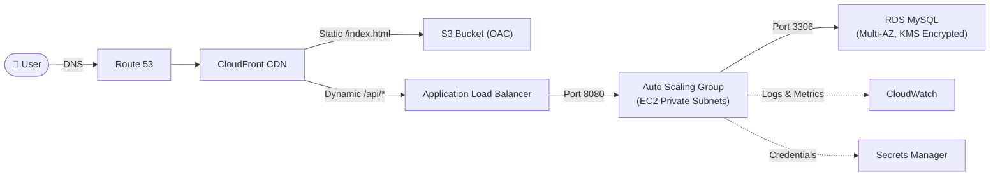

# AWS Three-Tier Web Application Infrastructure


A **production-grade, enterprise-scale** AWS Three-Tier Web Application built entirely with modular Terraform. Features VPC network segmentation, Auto Scaling compute, Multi-AZ RDS database, CloudFront CDN, and full observability — deployed across dev, staging, and production environments.

---

## 🌐 Live Interactive Portals

| Portal | Live URL | Description |
|---|---|---|
| **Enterprise Operations Console** | [three-tier-app.vercel.app](https://three-tier-app.vercel.app/) | Production operations console with real-time metrics, topology flow & cloud CLI |
| **Source Code & API Sandbox** | [three-tier-app-src.vercel.app](https://three-tier-app-src.vercel.app/) | Interactive Node.js backend explorer, Docker manifests & live API tester |
| **Terraform Modules Visualizer** | [three-tier-app-modules.vercel.app](https://three-tier-app-modules.vercel.app/) | Visual catalog of all 11 Terraform modules with HCL code viewers |
| **Multi-Environment Dashboard** | [three-tier-app-environments.vercel.app](https://three-tier-app-environments.vercel.app/) | Dev vs Staging vs Prod parameter matrices and FinOps cost comparison |
| **Documentation Hub** | [three-tier-app-docs.vercel.app](https://three-tier-app-docs.vercel.app/) | Complete knowledge base covering architecture, troubleshooting, security & interview Q&A |

---

## Architecture Overview



### Request Flow

1. **User** → DNS resolution via **Route 53** (alias to CloudFront)
2. **CloudFront** → Serves cached static assets from **S3** (via OAC) or forwards `/api/*` to **ALB**
3. **ALB** → Health-checked routing to **EC2 instances** in private app subnets
4. **EC2** → Fetches DB credentials from **Secrets Manager**, connects to **RDS MySQL** in isolated data subnets
5. **CloudWatch** ← Collects metrics, logs, and triggers alarms via **SNS**

---

## Features

- ✅ **Multi-tier VPC** — Public, private-app, and isolated private-data subnets across 2-3 AZs
- ✅ **Least-privilege Security Groups** — Chained SG references (ALB → App → RDS)
- ✅ **Auto Scaling** — CPU + ALB request count target tracking policies
- ✅ **RDS Multi-AZ** — KMS-encrypted storage, automated backups, Secrets Manager integration
- ✅ **CloudFront CDN** — Origin Access Control (OAC), dual-origin (S3 + ALB)
- ✅ **ACM SSL/TLS** — DNS-validated certificates, HTTP→HTTPS redirect
- ✅ **SSM Session Manager** — No SSH keys, no port 22, IMDSv2 enforced
- ✅ **CloudWatch Observability** — Dashboards, alarms, log groups, SNS notifications
- ✅ **Multi-environment** — dev/staging/prod with separate VPCs, configs, and state files
- ✅ **CI/CD Pipeline** — GitHub Actions with fmt, validate, plan, checkov scan, apply
- ✅ **Remote State** — S3 + DynamoDB state locking with versioning

---

## Prerequisites

| Tool | Version | Installation |
|------|---------|-------------|
| AWS CLI | v2.x+ | [Install Guide](https://docs.aws.amazon.com/cli/latest/userguide/getting-started-install.html) |
| Terraform | v1.5.0+ | [Install Guide](https://developer.hashicorp.com/terraform/install) |
| Git | v2.x+ | [Install Guide](https://git-scm.com/downloads) |
| AWS Account | Active | With sufficient IAM permissions |

---

## Quick Start

```bash
# 1. Clone the repository
git clone <repository-url> && cd "WS Three-Tier Web Application"

# 2. Bootstrap remote state backend (one-time)
aws s3api create-bucket --bucket three-tier-tf-state-dev --region us-east-1
aws dynamodb create-table --table-name three-tier-tf-locks-dev \
  --attribute-definitions AttributeName=LockID,AttributeType=S \
  --key-schema AttributeName=LockID,KeyType=HASH \
  --billing-mode PAY_PER_REQUEST --region us-east-1

# 3. Initialize and deploy
cd environments/dev
terraform init
terraform plan -var-file="terraform.tfvars" -out=tfplan
terraform apply tfplan
```

---

## Project Structure

```
├── .github/workflows/
│   └── terraform.yml              # CI/CD: fmt, validate, plan, checkov, apply
├── docs/
│   ├── ARCHITECTURE.md            # Detailed architecture deep-dive
│   ├── COST_ESTIMATION.md         # Per-environment cost breakdown
│   ├── DEPLOYMENT.md              # Step-by-step deployment guide
│   ├── INTERVIEW_QUESTIONS.md     # 20 Q&A for interview prep
│   ├── ROADMAP.md                 # Future improvements roadmap
│   ├── ROLLBACK.md                # Rollback procedures for all tiers
│   ├── SECURITY.md                # Security controls & best practices
│   └── TROUBLESHOOTING.md         # Common failure scenarios & fixes
├── environments/
│   ├── dev/                       # Development environment configs
│   ├── staging/                   # Staging environment configs
│   └── prod/                      # Production environment configs
├── modules/
│   ├── acm/                       # ACM certificate management
│   ├── alb/                       # Application Load Balancer
│   ├── asg/                       # Auto Scaling Group + Launch Template
│   ├── cloudfront/                # CloudFront CDN distribution
│   ├── cloudwatch/                # Alarms, dashboards, log groups
│   ├── iam/                       # IAM roles, policies, instance profiles
│   ├── rds/                       # RDS MySQL + Secrets Manager
│   ├── route53/                   # DNS alias records
│   ├── s3/                        # Static assets + access logs buckets
│   ├── security_groups/           # Least-privilege SG chain
│   └── vpc/                       # VPC, subnets, IGW, NAT, route tables
├── src/
│   ├── app/                       # Node.js sample application
│   └── scripts/
│       └── user_data.sh.tpl       # EC2 bootstrap template
└── README.md
```

---

## Module Documentation

| Module | Description | Key Inputs | Key Outputs |
|--------|-------------|-----------|------------|
| **vpc** | VPC with 3-tier subnets, IGW, NAT GWs, route tables | `vpc_cidr`, `availability_zones`, `single_nat_gateway` | `vpc_id`, `public_subnet_ids`, `private_app_subnet_ids` |
| **security_groups** | Chained SGs: ALB → App → RDS | `vpc_id`, `app_port`, `db_port` | `alb_security_group_id`, `app_security_group_id`, `rds_security_group_id` |
| **iam** | EC2 role with SSM, CloudWatch, S3, Secrets Manager | `s3_bucket_arns` | `instance_profile_name`, `role_arn` |
| **s3** | Static assets bucket (OAC) + logs bucket | `cloudfront_arn`, `force_destroy` | `static_bucket_arn`, `logs_bucket_id` |
| **acm** | ACM certificate with DNS validation | `domain_name`, `hosted_zone_id` | `arn` |
| **alb** | ALB with target group, HTTPS listener, HTTP redirect | `certificate_arn`, `target_port`, `health_check_path` | `alb_dns_name`, `target_group_arn` |
| **asg** | Launch template + ASG + scaling policies | `instance_type`, `min/max/desired`, `user_data_base64` | `asg_name`, `asg_arn` |
| **rds** | MySQL Multi-AZ, KMS encryption, Secrets Manager | `instance_class`, `multi_az`, `allocated_storage` | `db_endpoint`, `secret_arn` |
| **cloudfront** | CDN with OAC (S3) + custom origin (ALB) | `s3_bucket_domain_name`, `alb_dns_name`, `acm_certificate_arn` | `distribution_domain_name`, `distribution_arn` |
| **route53** | Alias A/AAAA records | `domain_name`, `target_domain_name`, `hosted_zone_id` | `a_record_fqdn` |
| **cloudwatch** | Dashboard, alarms (CPU/5xx/storage), SNS, log groups | `asg_name`, `alb_arn_suffix`, `alarm_email` | `log_group_name`, `sns_topic_arn` |

---

## Environment Configurations

| Parameter | Dev | Staging | Production |
|-----------|-----|---------|------------|
| AZs | 2 | 2 | 3 |
| NAT Gateways | 1 (single) | 2 (multi-AZ) | 3 (multi-AZ) |
| EC2 Instance Type | t3.micro | t3.small | c6i.large |
| ASG Size (min/desired/max) | 1/1/3 | 2/2/4 | 3/3/12 |
| RDS Instance Class | db.t4g.micro | db.t4g.small | db.r6g.xlarge |
| RDS Multi-AZ | No | Yes | Yes |
| RDS Storage | 20 GB | 30 GB | 100 GB |
| Backup Retention | 7 days | 7 days | 30 days |
| Deletion Protection | No | No | Yes |
| Est. Monthly Cost | ~$97 | ~$230 | ~$1,144 |

---

## CI/CD Pipeline

The GitHub Actions workflow (`.github/workflows/terraform.yml`) provides:

1. **On Pull Request**: `terraform fmt` → `terraform validate` → Checkov security scan → `terraform plan` (posted as PR comment)
2. **On Merge to Main**: Manual approval gate → `terraform apply`

---

## Documentation

| Document | Description |
|----------|-------------|
| [ARCHITECTURE.md](docs/ARCHITECTURE.md) | Detailed architecture deep-dive with Mermaid diagrams |
| [DEPLOYMENT.md](docs/DEPLOYMENT.md) | Step-by-step deployment from init to live URL |
| [ROLLBACK.md](docs/ROLLBACK.md) | Rollback procedures for ASG, RDS, Terraform state |
| [TROUBLESHOOTING.md](docs/TROUBLESHOOTING.md) | 10 common failure scenarios with diagnostic commands |
| [SECURITY.md](docs/SECURITY.md) | Security controls matrix and best practices |
| [COST_ESTIMATION.md](docs/COST_ESTIMATION.md) | Per-environment cost breakdown and optimization |
| [INTERVIEW_QUESTIONS.md](docs/INTERVIEW_QUESTIONS.md) | 20 interview Q&A with model answers |
| [ROADMAP.md](docs/ROADMAP.md) | Phased improvement roadmap (WAF, ECS, Aurora, DR) |

---

## Contributing

1. Fork the repository
2. Create a feature branch (`git checkout -b feature/improvement`)
3. Commit changes (`git commit -am 'Add new feature'`)
4. Push to branch (`git push origin feature/improvement`)
5. Open a Pull Request — CI will run format, validate, and security checks automatically

---

## License

This project is licensed under the MIT License.

```
MIT License

Copyright (c) 2024

Permission is hereby granted, free of charge, to any person obtaining a copy
of this software and associated documentation files (the "Software"), to deal
in the Software without restriction, including without limitation the rights
to use, copy, modify, merge, publish, distribute, sublicense, and/or sell
copies of the Software, and to permit persons to whom the Software is
furnished to do so, subject to the following conditions:

The above copyright notice and this permission notice shall be included in all
copies or substantial portions of the Software.

THE SOFTWARE IS PROVIDED "AS IS", WITHOUT WARRANTY OF ANY KIND, EXPRESS OR
IMPLIED, INCLUDING BUT NOT LIMITED TO THE WARRANTIES OF MERCHANTABILITY,
FITNESS FOR A PARTICULAR PURPOSE AND NONINFRINGEMENT.
```
