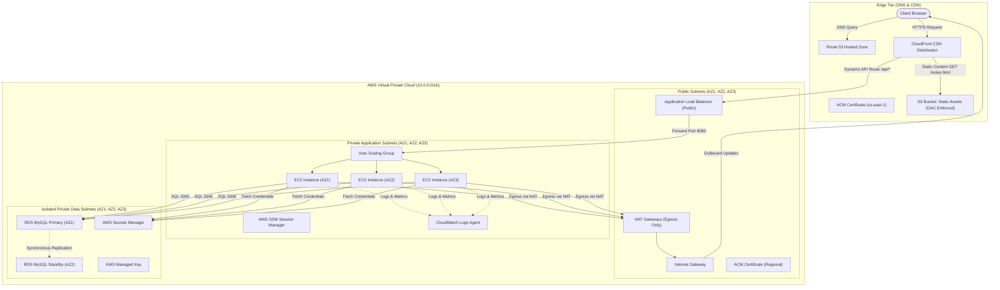

# Architecture Deep Dive: AWS Three-Tier Web Infrastructure

This document provides a comprehensive technical breakdown of the production-ready AWS Three-Tier Web Application deployed via Terraform.

## Tiered Architecture Diagram

---

## Detailed Component Breakdown

### 1. Presentation Tier (Edge)
- **Route 53**: Resolves custom apex and subdomain requests using latency-based Alias A/AAAA records pointing directly to CloudFront distribution edge locations.
- **ACM SSL/TLS**: CloudFront uses a 2048-bit RSA / ECDSA certificate requested in `us-east-1` with DNS validation. ALB uses a separate regional ACM certificate.
- **CloudFront CDN**: Configured with Origin Access Control (OAC) to sign requests to the private S3 bucket. Low latency static assets cached globally; `/api/*` traffic forwarded to ALB origin without caching (`Cache-Control: no-cache`).

### 2. Application Tier (Compute)
- **Multi-AZ Network Layout**: Spans 3 Availability Zones (`us-east-1a`, `us-east-1b`, `us-east-1c`).
- **Application Load Balancer (ALB)**: Listens on port 80 (HTTP 301 redirect to HTTPS) and port 443. Performs active health checks against target instances at `/api/health`.
- **Auto Scaling Group (ASG)**: Bootstraps Amazon Linux 2023 instances running Node.js / Express web services via systemd. Scales dynamically using dual target tracking policies:
  - Average CPU Utilization = 70%
  - ALB Request Count Per Target = 1000 requests/instance

### 3. Data Tier (Persistence)
- **RDS MySQL Multi-AZ**: Primary node in AZ1, synchronous block-level standby node in AZ2. Automatic failover under 60 seconds.
- **Storage & KMS**: AES-256 storage encryption backed by AWS KMS customer-managed key. Automated snapshots retained for 7 to 30 days.
- **Secrets Management**: DB master credentials automatically generated, stored, and rotated inside AWS Secrets Manager. EC2 instances retrieve secrets via IAM Role + IAM policy without hardcoded credentials.

---

## Least Privilege Network Matrix

| Source Security Group | Destination Security Group | Allowed Port | Protocol | Purpose |
|-----------------------|----------------------------|--------------|----------|---------|
| Internet (`0.0.0.0/0`) | `alb-sg` | 80, 443 | TCP | Public Web Traffic |
| `alb-sg` | `app-sg` | 8080 | TCP | Load Balancer to EC2 App Instances |
| `app-sg` | `rds-sg` | 3306 | TCP | EC2 App Instances to MySQL Database |
| `app-sg` | Internet (`0.0.0.0/0`) via NAT | 443 | TCP | Outbound AWS API Calls (SSM, Secrets Manager, CloudWatch) |
